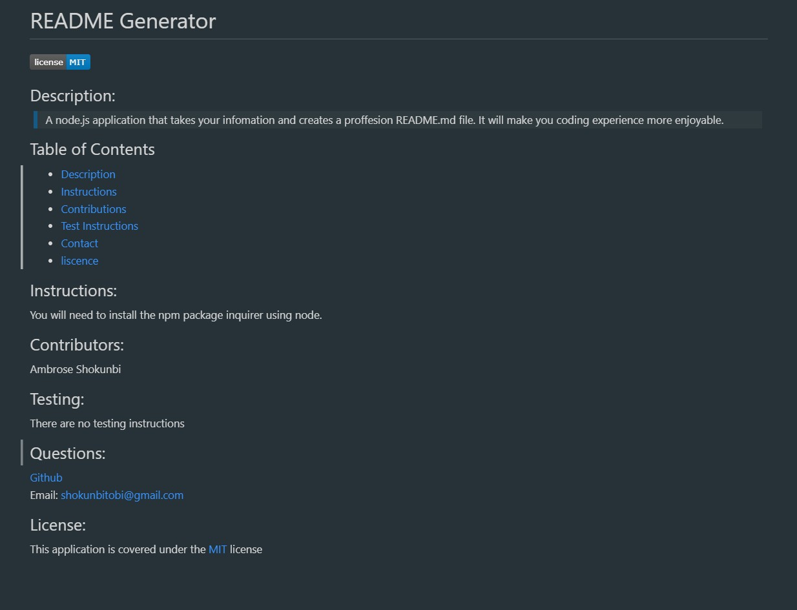

# README Generator

## Description:
<blockquote>

A simple node.js application that takes your infomation and creates a proffesion README.md file. It will make you coding experience more enjoyable.

</blockquote>

## Table of Contents
- [Description](#description)
- [Instructions](#instructions)
- [Contributions](#contributors)
- [Test Instructions](#testing)
- [Image](#image)
- [Contact](#questions)
- [license](#license)

## Instructions:

You will need to install the npm package inquirer using node.

## Contributors:

Ambrose Shokunbi

## Testing:

There are no testing instructions.

## Image:

## Questions:
[Github](https://github.com/ashokunb)
 
[Github Project](https://github.com/ashokunb/Readme-generator-java)
 
Email: shokunbitobi@gmail.com

## License:

  This application is covered under the [MIT](https://spdx.org/licenses/MIT.html) license
 
